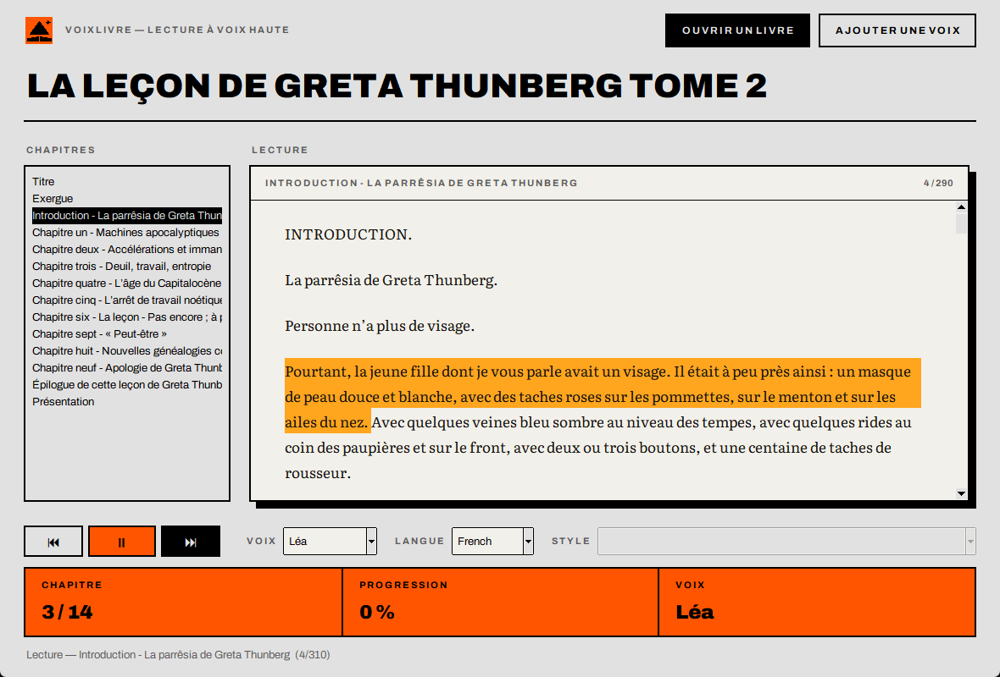

# VoixLivre

Écouter un ebook (EPUB, TXT, PDF) lu par une voix de synthèse, dans une interface simple et sobre.
La voix est générée localement sur votre carte graphique avec le modèle
[Qwen3-TTS-12Hz-1.7B-CustomVoice](https://huggingface.co/Qwen/Qwen3-TTS-12Hz-1.7B-CustomVoice).



L'interface reprend l'identité visuelle de [MontLivre](https://simon256px.github.io/MontLivre/) :
polices Archivo et Literata, noir, gris nuage, papier et orange.

## Fonctionnalités

- **Bibliothèque** au démarrage : couverture, titre, auteur, progression et date de dernière lecture
  de chaque livre, rouvert en un clic à son marque-page
- **Mode jour / nuit** (bouton ☾ / ☀), mémorisé
- **Images et notes de l'ebook** affichées à leur place (jamais lues) : aperçu de la note au survol
  de l'appel, façon Obsidian (épinglé au clic) ; liste des notes en fin de chapitre
- **Activité Discord** (« Écoute VoixLivre ») : titre, auteur, progression, temps écoulé et bouton
  vers ce dépôt, textes personnalisables. Rien à configurer : bouton « Discord », cocher
  « Afficher sur mon profil Discord ce que j'écoute ».
- **Passage lu toujours au milieu** de la page, **surlignage** personnel par livre et **marque-page**
  posé automatiquement là où l'on s'arrête

- Ouverture de livres **EPUB**, **TXT** et **PDF**, avec la liste des chapitres
- Texte affiché, passage en cours **surligné**, défilement automatique
- Double-clic sur un chapitre ou une phrase pour y lancer la lecture
- ⏮ ▶/⏸ ⏭ et raccourcis clavier : `Espace` (pause/lecture), `←` `→` (passage précédent/suivant)
- 4 voix de femmes : **Léa**, **Clara** et **Margot** (voix françaises natives créées pour
  l'application, lecture envoûtante) et **Manon** (voix intégrée au modèle, avec choix du **style**)
- **Voix clonées** : ajoutez n'importe quelle voix à partir d'un extrait audio de 10 à 20 secondes
  (voir [voix/](voix/LISEZMOI.md))
- **Reprise automatique** là où vous vous êtes arrêté dans chaque livre
- Génération par lots et mise en cache : lecture continue sans blanc, sauts instantanés

## Prérequis

- Windows, Linux ou macOS avec Python 3.10+
- Une carte graphique **NVIDIA** est fortement recommandée (≈ 6 Go de mémoire vidéo, ≈ 12 Go en utilisant
  aussi les voix clonées) : sur CPU, la génération est trop lente pour une écoute en continu
- ~10 Go d'espace disque pour les deux modèles (téléchargés automatiquement au premier usage)

## Installation

```bash
pip install torch torchaudio --index-url https://download.pytorch.org/whl/cu128
pip install -r requirements.txt
```

## Utilisation

```bash
python voixlivre.py              # puis « Ouvrir un livre… »
python voixlivre.py monlivre.epub
```

Sous Windows, double-cliquez simplement sur `VoixLivre.bat`.

Un petit livre de test, `exemple.epub`, est fourni.

## Remarques

- Manon (voix « Sohee » du modèle) n'est pas francophone native : un style contenant « sans accent »
  réduit l'accent. Léa, Clara et Margot parlent un français natif.
- Les voix clonées reproduisent le ton de leur extrait : le champ « Style » est alors désactivé.
- La première utilisation d'une voix clonée charge un second modèle (~20 s).
- Le message « SoX could not be found » affiché au démarrage est sans conséquence.
- La progression et les réglages sont enregistrés dans `~/.voixlivre.json`.

## Crédits

- Polices [Archivo](https://github.com/Omnibus-Type/Archivo) et [Literata](https://github.com/googlefonts/literata),
  licence SIL Open Font License 1.1 (`assets/fonts/`).
- Icône et identité visuelle : [MontLivre](https://github.com/Simon256px/MontLivre).
